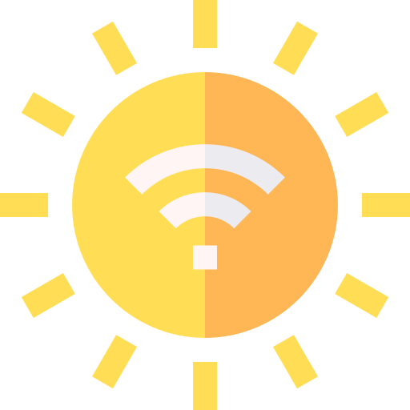

Globo Terrestre IoT
======================


Um projeto usando o ESP8266 Nodemcu.

Este projeto foi construido sobre minha necessidade de entender melhor a comunicação por Wi-Fi dos microcontroladores ESP8266.

E realizar a integração desse microcontrolador com Windows, OSX, Linux, iOS e Android.

### Tecnologias exploradas no projeto:

 - Atualização Over-The-Air (OTA)
 - Transmission Control Protocol (TCP)
 - User Datagram Protocol (UDP)
 - Hypertext Transfer Protocol (HTTP)
 - WebSocket
 - multicast DNS (mDNS)

<table align="center">
  <tr >
    <th>Tecnologia</th>
    <th>Ultilidade no projeto</th>
  </tr>
  <tr align="center">
    <td>OTA</td>
    <td>Atualização/Reprogramação do ESP8266 de forma remota usando apenas o Wi-Fi.</td>
  </tr>
  <tr align="center">
    <td>UDP</td>
    <td>Protocolo usado para debugar remotamente o projeto.</td>
  </tr>
  <tr align="center">
    <td></td>
    <td></td>
  </tr>
  <tr align="center">
    <td></td>
    <td></td>
  </tr>

</table>

### Resumo sobre as tecnologias usadas

#### Pilha de protocolos TCP/IP

<table align="center">
  <tr >
    <th>Camada</th>
    <th>Protocolos</th>
  </tr>
  <tr align="center">
    <td>Aplicação</td>
    <td>HTTP, WebSocket, mDNS ...</td>
  </tr>
  <tr align="center">
    <td>Transporte</td>
    <td>TCP, UDP</td>
  </tr>
  <tr align="center">
    <td>Rede</td>
    <td>IP</td>
  </tr>
  <tr align="center">
    <td>Interface de Rede</td>
    <td>Ethernet, Wi-Fi ...</td>
  </tr>
</table>

#### Atualização Over-The-Air (OTA)

O Over-The-Air não é um protocolo e sim uma forma de enviar um Firmware para o dispositivo sem necessidade de cabos. O OTA permite reprogramar o microcontrolador através da rede Wi-Fi sem a necessidade de removê-lo do local que ele está instalado.

#### Transmission Control Protocol (TCP)

O protocolo TCP é mais utilizado por oferecer confiabilidade durante a comunicação. O TCP garante que os pacotes de dados trafegados permaneçam inalterados e que cheguem na mesma ordem com que foram enviados.

#### User Datagram Protocol (UDP)

O UDP é um protocolo que não garante a chegada dos dados. Por esse motivo o UDP é mais rápido que o TCP, pois não realiza a verificação de erros nos pacotes de dados.

#### Hypertext Transfer Protocol (HTTP)

O HTTP é um protocolo unidirecional (a transmissão ocorre só de uma ponta para a outra), onde o cliente envia a requisição e o servidor retorna a resposta, finalizando ali a conexão.

#### WebSocket

WebSocket é um protocolo que permite a criação de um canal de comunicação cliente-servidor com transmissão bidirecional onde ambos os lados (cliente e servidor) podem transmitir dados simultaneamente. WebSocket veio para suprir as deficiências do protocolo HTTP para esse objetivo.

#### multicast DNS (mDNS)

O mDNS é um protocolo DNS Multicast. Um "multicast" repassa a mesma mensagem para vários pontos em uma rede. O mDNS é um método para descoberta de vizinhos de uma rede, indicado para redes pequenas sem servidores DNS próprios.


Crie o arquivo `src/arduino_secrets.h` seguindo o modelo do `src/arduino_secrets.h.example`

`platformio device list --mdns`

`platformio run --target uploadfs`


https://cdn.jsdelivr.net/gh/guilhermerodrigues680/esp8266-globo-terrestre/HTML-Pages/404.html
https://raw.githack.com/guilhermerodrigues680/esp8266-globo-terrestre/master/HTML-Pages/404.html


### Servidor de testes local

Python

```sh
# Acesse a pasta contendo o Filesystem do ESP8266
cd data

# Veja a versão do python
python -V

# Se a versão do Python retornada acima for 3.X
python3 -m http.server
# No windows, tente "python" em vez de "python3"

# Se a versão do Python retornada acima for 2.X
python -m SimpleHTTPServer
```

Node.js 12.18.2+ (Server escrito usando esta versão do Node.js, não foi checada a compatibilidade com versões anteriores)

```sh
# Acesse a pasta contendo o servidor web
cd server

# Se for a primeira vez, instale as dependencias do projeto
npm install

# Node.js
nvm use 12.18.2
npm start
```


### TODO

 - PWA App
 - Desligar Motor após movimentar
 - Rota para desligar o sistema
 - Atualizar documentação

## Autor

<table>
  <tr>
    <td align="center"><a href="https://github.com/guilhermerodrigues680"><br /><sub><b>Guilherme Rodrigues</b></sub></a><br />
  </tr>
</table>

### Attribution

<div>Icons made by <a href="https://www.flaticon.com/authors/freepik" title="Freepik">Freepik</a> from <a href="https://www.flaticon.com/" title="Flaticon">www.flaticon.com</a></div>
